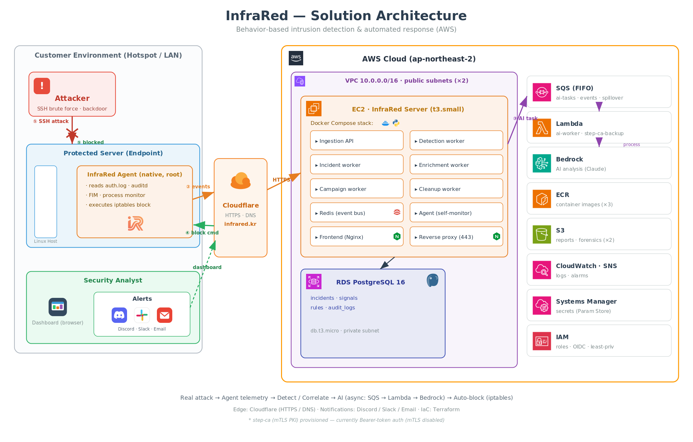

<div align="center">

# InfraRed

**행위 기반 침입 탐지 · 자동 대응 보안 플랫폼**
_Behavior-based Intrusion Detection & Automated Response for Linux / Container_

실시간 SSH·웹 공격 탐지 · 약 10초 내 자동 IP 차단 · MITRE ATT&CK 공격 체인 상관분석 · AI 인시던트 요약 · Discord / Slack / Email 알림

[데모](https://app.infrared.kr) · [API 문서](https://api.infrared.kr/docs) · [보안 설계](docs/SECURITY.md) · [로컬 실행](docs/LOCAL_RUN.md)


</div>

---

## 무엇을 하는가

InfraRed는 Linux 서버·컨테이너에서 발생하는 **SSH 무차별 대입, 웹셸, SQL 인젝션, 파일 무결성(FIM) 변조, 권한 상승 체인**을 실시간으로 감시하는 호스팅형 보안 운영(SOC) 플랫폼입니다. 고신뢰 위협이 탐지되면 약 10초 안에 에이전트로 `iptables` 차단 명령을 내려보내고, kill-chain 단계와 ATT&CK 기법을 담은 인시던트를 생성한 뒤 Discord·Slack·이메일로 팀에 알립니다.

Wazuh·Splunk·Sentinel을 직접 구축하지 않고도 SOC급 탐지와 자동 대응을 원하는 팀을 위해 만들었습니다.

## 아키텍처



실제 공격 → 에이전트 텔레메트리 → 탐지/상관분석 → AI 분석(비동기: SQS → Lambda → Bedrock) → 자동 차단(iptables)으로 이어지는 단일 경로입니다. 엣지는 Cloudflare(HTTPS·DNS), 인프라는 Terraform으로 관리합니다.

## 핵심 기능

| 기능 | 상태 | 비고 |
|---|---|---|
| AUTH 탐지 (무차별 대입, root 로그인, 잘못된 사용자, 실패→성공, 의심 로그인) | ✅ | AUTH-001 ~ AUTH-007 |
| WEB 탐지 (SQL 인젝션, 경로 탐색, 관리자 스캔, 404 폭주, 웹셸, CVE 프로빙) | ✅ | WEB-001 ~ WEB-007 + WEB-HNY-001 |
| FIM (authorized_keys, sshd_config, crontab, /etc/passwd, /etc/sudoers 변조) | ✅ | 해시 기반, 에이전트 측 |
| Tmp / 웹셸 / 대량 변경 실행 모니터 | ✅ | EXEC-001/002/003 + EXEC-FIRST |
| 디셉션 (허니토큰, 가짜 관리자 계정, 카나리 경로) | ✅ | DECEPTION-001/002/003 |
| 공격 체인 상관분석 (SSH 침해, 웹셸, 권한 상승, 랜섬웨어, 측면 이동) | ✅ | 7개 시나리오 |
| 자동 대응: iptables 차단, 서버 격리, 컨테이너 격리, 계정 잠금, JIT-SSH 회수 | ✅ | confidence ≥ 0.85 + CRITICAL 시 자동 |
| 중간 신뢰도 차단 승인 워크플로우 | ✅ | TTL + 연장 지원 |
| AI 인시던트 요약 (Bedrock Claude, 정적 폴백) | ✅ | 인시던트별, 캐시 |
| RBAC (owner / security_manager / analyst / viewer) + 초대 + 이메일 인증 + 비밀번호 재설정 | ✅ | 멀티테넌트 |
| Discord / Slack / Email 알림 (Embed · Block Kit) | ✅ | 테넌트별 webhook 설정 |
| Sentry + Prometheus 연동 | ✅ | 선택, env opt-in |
| 대시보드 (인시던트 타임라인, 멤버, 룰 관리, 리포트) | ✅ | React + Vite |
| 에이전트: Linux (Python + systemd), Windows, macOS | 🟡 | Linux 운영 준비 완료 · Windows/macOS 프리뷰 |

## 빠른 시작 (셀프 호스팅)

Docker, Docker Compose, 약 2 GB RAM 필요.

```bash
git clone https://github.com/team-chain/InfraRed.git
cd InfraRed
cp .env.example .env

# 에이전트 JWT 시크릿 생성
python scripts/generate_jwt.py --role agent > /tmp/agent_token.txt
sed -i "s|^AGENT_TOKEN=.*|AGENT_TOKEN=$(cat /tmp/agent_token.txt)|" .env

# 스택 기동
docker compose up -d
```

접속:

- 대시보드: http://localhost:3000
- API: http://localhost:8000 (Swagger: `/docs`)

데모 로그인: `admin@infrared.local` / `infrared123` (테넌트 `company-a`). 운영 환경에서는 `docker compose up` 전에 `.env`에 `INITIAL_ADMIN_EMAIL` · `INITIAL_ADMIN_PASSWORD`를 설정하면 첫 마이그레이션 시 실제 관리자 계정이 자동 생성됩니다.

자세한 로컬 실행: [docs/LOCAL_RUN.md](docs/LOCAL_RUN.md).

## 시스템 구성

런타임은 EC2 위 Docker Compose 스택으로 동작하며, AI·큐·스토리지는 AWS 매니지드 서비스를 사용합니다.

```
백엔드 스택 (EC2 · Docker Compose)
  ingestion          수집 API (FastAPI)               frontend         대시보드 정적 서빙 (Nginx)
  detection-worker   룰 매칭 · 시그널 생성             agent            자체 모니터링 에이전트
  enrichment-worker  CTI · GeoIP 보강                 watchdog         self-heal 감시
  incident-worker    공격 체인 상관 · 인시던트 생성    step-ca          mTLS PKI (프로비저닝됨)
  campaign-worker    알림 그룹핑                       redis            이벤트 버스 (Streams)
  cleanup-worker     보존 정책 / TTL

AWS 매니지드
  SQS (FIFO) → Lambda(ai-worker) → Bedrock(Claude)    비동기 AI 분석
  RDS PostgreSQL 16   incidents · signals · rules · audit_logs
  ECR · S3 · CloudWatch · SNS · Systems Manager(Param Store) · IAM(OIDC)
```

> **AI 경로는 비동기입니다.** 백엔드가 직접 Bedrock을 호출하지 않고 SQS(FIFO)에 작업을 적재하면, Lambda `ai-worker`가 이를 소비해 Bedrock(Claude)으로 분석합니다. 별도의 인-프로세스 LLM 워커는 없습니다.

전체 데이터 흐름 다이어그램: 위 [아키텍처](#아키텍처) 섹션 / 원본 이미지 `InfraRed_아키텍처.png`.

## 폴더 구조

```
backend/        FastAPI + 워커 (detection / enrichment / incident / campaign / cleanup)
frontend/       React + Vite 대시보드
agent/          Linux 에이전트 (auth.log·nginx tailer, FIM, EXEC 모니터, commander)
macos_agent/    macOS 에이전트 (프리뷰)
windows_agent/  Windows 에이전트 (프리뷰)
lambda/         AWS Lambda (ai_worker, cti_refresher, ttl_expiry, step_ca_backup 등)
infra/          Terraform, Docker, nginx, Prometheus, 샘플 로그
scripts/        설치 one-liner, JWT 헬퍼, 로그 생성기, 스모크 테스트
docs/           보안·역할·Bedrock 셋업·로컬 실행 등 설계 문서
```

## 탐지 룰

AUTH / WEB / FIM / EXEC / DECEPTION / NET / 상관분석에 걸친 **30개 운영 룰**. 각 룰은 confidence 점수를 가지며, ≥ 0.85 + CRITICAL 심각도면 에이전트를 통해 `iptables` 차단이 자동 발동됩니다. 전체 룰 카탈로그: [InfraRed_보안룰_레퍼런스.md](InfraRed_보안룰_레퍼런스.md).

## 보안 설계

InfraRed는 그 자체가 보안 제품이므로, 같은 통제를 스스로에게 적용합니다.

- 멀티테넌트 데이터 격리 (모든 쿼리에 테넌트별 `tenant_id` 스코핑)
- Postgres `pgcrypto.crypt()` 기반 bcrypt 비밀번호 해싱
- 폐기 목록(deny-list)을 가진 JWT (Redis 기반, jti·user 단위 revoke)
- Discord/Slack webhook URL은 절대 로깅하지 않음
- 서버 격리 TTL에 대한 Dead Man's Switch
- 백엔드 → 에이전트 명령에 nonce + HMAC 서명
- Pydantic 입력 검증, 파라미터 바인딩 SQL만 사용

> **에이전트 인증 현황:** mTLS PKI(step-ca)는 프로비저닝되어 있으나 현재 러닝 스택은 **Bearer 토큰 인증**을 사용합니다(mTLS 비활성). 운영 전환 시 step-ca 기반 mTLS로 승격하는 것이 다음 단계입니다.

보안 상세: [docs/SECURITY.md](docs/SECURITY.md) · 역할/권한 워크플로우: [docs/ROLES.md](docs/ROLES.md) · Bedrock 셋업: [docs/AWS_BEDROCK_SETUP.md](docs/AWS_BEDROCK_SETUP.md).

## 기술 스택

| 영역 | 사용 기술 |
|---|---|
| 백엔드 | Python 3.11 · FastAPI · Redis Streams · SQLAlchemy |
| 프론트엔드 | React · Vite · TypeScript |
| 데이터 | PostgreSQL 16 (RDS) · Redis |
| AI | AWS Bedrock (Claude) · SQS(FIFO) · Lambda |
| 인프라 | AWS (EC2 · RDS · SQS · Lambda · ECR · S3 · CloudWatch · SNS · SSM · IAM) |
| 엣지 | Cloudflare (HTTPS · DNS) |
| 배포 | Docker Compose · Terraform · GitHub Actions |

## 라이선스

평가 목적의 source-available. 운영 사용은 계약 기반 — 팀에 문의.
